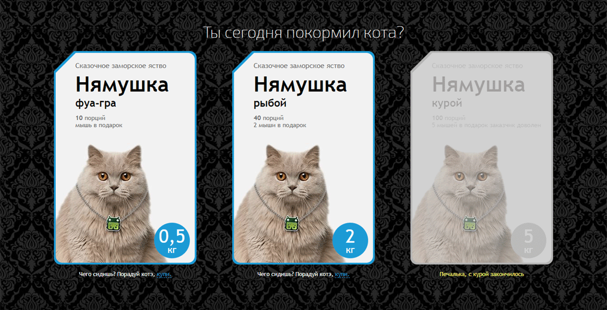

# [Задание для разработчиков HTML/CSS/JS](https://agants.github.io/funbox-test/)

## Задание:
* Фон занимает всю площадь экрана, блок находится по центру вертикально и горизонтально
* На планшетах упаковки располагаются треугольником, на смартфонах друг под другом
* Информация о продукте может меняться
* Каждая из упаковок может быть выбрана или недоступна для выбора. Выбор осуществляется нажатием на упаковку или на текст «купи» в описании
* Можно выбрать одновременно несколько упаковок, а также отменить свой выбор повторным нажатием на упаковку
* Состояние наведения применяется к выбранной упаковке не сразу, а после того, как курсор ушел с нее после первоначального выбора

## В вёрстке:
* Сборщик gulp
* Шаблонизатор и препроцессоры
* Адаптивность под мобильные устройства
* Используется Vue.js
